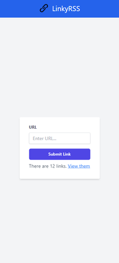
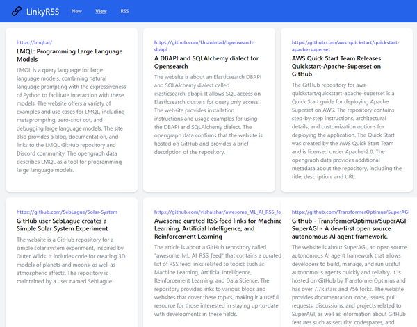
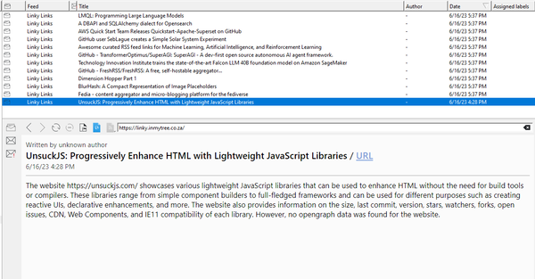

# LinkyRSS: AI-Powered Bookmarking Tool 📚🔖

Welcome to **LinkyRSS** - the combination of RSS, Bookmarks and AI. LinkyRSS will automatically summarise the actual content of the things you bookmark and make it available as an RSS feed for tagging/searching/consumption in your existing RSS flow.


**Want to try LinkyRSS? Visit our [demo site](http://linkyrssdemo.inmytree.co.za)**

> **Note:** Links posted to the demo site maybe be cleared out periodically.


*Adding a new link*


*View page on the web app*


*Generated RSS feed in RSSGuard*


## Key Features 🌟

- **AI-Generated Summaries:** Don't just store links, get a concise and informative summary of the content. 

- **RSS Feed:** Access your bookmarks anytime, anywhere using your favorite RSS reader. Stay updated on your saved content effortlessly.

- **Automated Title and Summary:** Simply provide a link and LinkyRSS will automatically generate a suitable title and summary.

- **Effective Categorization & Search:** Tired of losing important links in a disorganized mess? With LinkyRSS, you can leverage your existing RSS tagging mechanism.

## System Design 🧩

LinkyRSS is designed to be simple yet robust. At its core, it's a Flask application. It leverages Langchain to utilize AI language models like GPT from OpenAI to generate summaries and titles for links. At the moment, data is stored in either an in-memory database or a DynamoDB database (easy to extend for other database systems).

Routes available in the application are:
- `/` : Home page showing count of links saved.
- `/api/extract` : Post a URL here to extract its title and summary.
- `/view` : View all stored links with their titles and summaries.
- `/rss` : RSS feed of all stored links. RSS 2.0 XML compatible with all popular RSS readers.

## Getting Started 🚀

### Prerequisites

- Python 3.6+
- [OpenAI Key](https://platform.openai.com/signup/)
- (optional) [AWS Account](https://portal.aws.amazon.com/gp/aws/developer/registration/index.html) (optional, for DynamoDB and AWS Lambda support)

### Installation

1. Clone the repository to your local machine:

```bash
git clone https://github.com/YOUR_GITHUB_USERNAME/LinkyRSS.git
cd LinkyRSS
```

2. Install the necessary Python packages:

```bash
pip install -r requirements.txt
```

3. Export necessary environment variables:

- For OpenAI key:

```bash
export OPENAI_KEY=your_openai_key
```

- For AWS DynamoDB (optional)

```bash
export DATABASE_TYPE=dynamo
export DYNAMODB_TABLE=your_dynamodb_table
```

By default, the application uses an in-memory database. To use DynamoDB, set the DATABASE_TYPE to dynamo.

4. Run the application

```bash
Run the application:
```

Navigate to *localhost:8080* on your web browser to start using LinkyRSS!

## Adding LinkyRSS to Your Feed Reader 📑

Adding your LinkyRSS feed to your favorite feed reader is easy. Here's how you can do it:

1. Run your LinkyRSS application. Ensure it's either hosted on a server or running locally.

2. Navigate to the `/rss` endpoint of your LinkyRSS application. For instance, if you're running it locally on port 8080, the URL would be `http://localhost:8080/rss`.

3. Copy this URL.

4. Open your feed reader. The process of adding a new feed may vary between different feed readers. Generally, look for an option to "Add New Feed" or "Subscribe".

5. Paste the copied URL into the feed URL input box.

6. Confirm and add the feed.

Now, your LinkyRSS feed should be added to your feed reader. The reader will update with new bookmarks as they are added to your LinkyRSS.


## Contribution Guidelines 👨💻👩💻

LinkyRSS is an open source project, feel free to submit any changes.

## License 📄

LinkyRSS is distributed under the MIT license. See [LICENSE](LICENSE.md) for more information.

## Contact 📧

*Your Contact Information*


